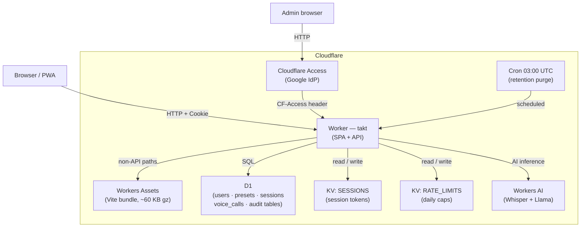
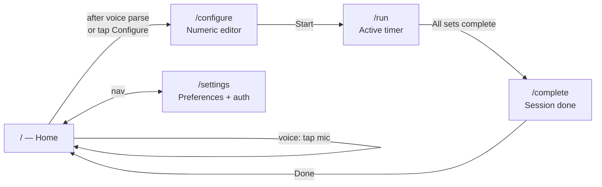
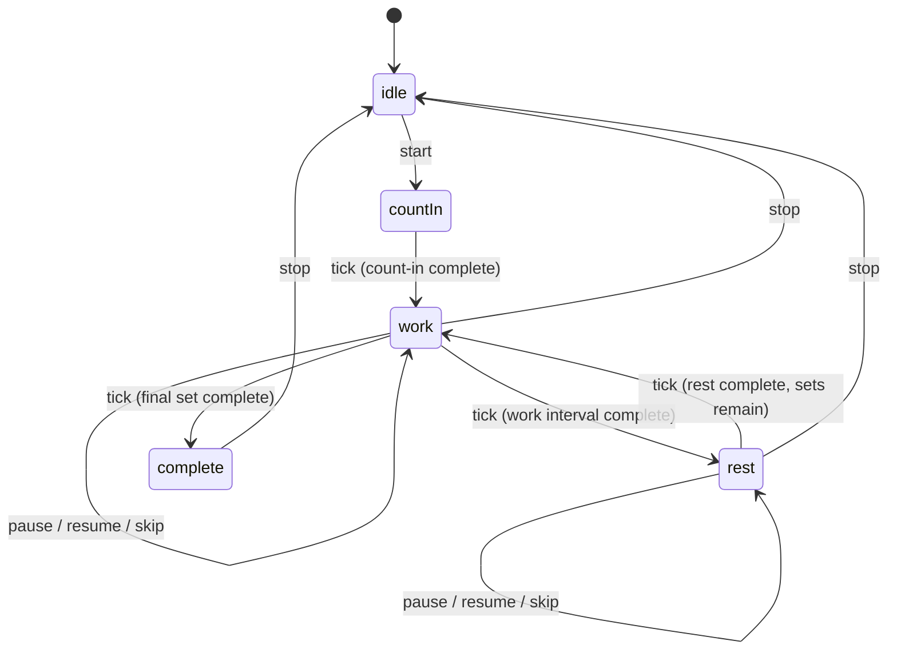
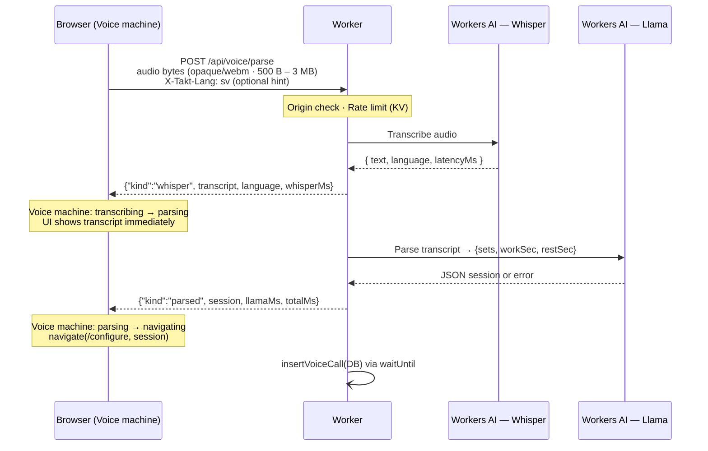

# Architecture

_Takt — keep it going._

This document describes how Takt is built, why each major piece exists, and how data flows through the system. It tells the story of the architecture rather than restating the API contracts — for those, see the [REFERENCE/](./REFERENCE/) docs linked throughout.

---

## Why this architecture

Takt started as a rehab training tool and ended up as a released app. The brief was simple: a dead-simple interval timer, voice-driven, no personal data, runs offline once configured. Every architectural choice flows from those four constraints.

**Voice-first but not voice-only.** Every action you can do by voice has a tap equivalent. That means the voice pipeline is an input layer, not the core — the timer runs the same way whether you spoke a session or tapped it in manually.

**No personal data.** Passkeys (WebAuthn) let users save presets and sync across devices without storing an email address, phone number, or name anywhere. The user identifier is a UUID. Passkey loss equals account loss — deliberately.

**Cloudflare-native.** Workers, D1, KV, Workers AI — everything runs on one platform with no external API calls, no custom server to operate, and a deployment story that fits in a single command.

**Offline after first run.** A configured session — timer, beeps, haptics — runs fully offline once the app has loaded. Voice requires a network round-trip; that is a platform limit, not a gap.

---

## System overview

Everything lives in a single Cloudflare Worker. The Worker serves the Vite-built SPA from Workers Assets for browser requests, and handles every `/api/*` and `/admin/*` route. There is no separate backend service.



The SPA is served with `run_worker_first = true` in `wrangler.toml`, meaning every browser request passes through the Worker before Assets handles it. This lets security headers (HSTS, CSP, `X-Frame-Options`) be applied uniformly to all responses, including static assets.

---

## The frontend

The frontend is a React + TypeScript SPA built with Vite and routed by React Router. Seven routes cover the entire product:



Four context providers wrap every route:

- **`I18nProvider`** — English/Swedish, runtime language detection, persisted to `localStorage`.
- **`SessionProvider`** — WebAuthn passkey auth state, session token management.
- **`SettingsProvider`** — language preference, accent colour, sound on/off.
- **`PhoneFrame`** — the desktop-browser phone mockup. Invisible on a real phone.

### The two state machines

The most important piece of frontend architecture is what is _not_ in React. Timer logic and voice pipeline logic live in pure TypeScript reducers, completely decoupled from the component tree.

**Pattern:** each machine is a pure function `(state, event) → { next: State, effects: Effect[] }`. The reducer never touches the DOM, audio, network, or navigation — it returns a list of effects as data, and a React hook executes them in order. This makes both machines fully unit-testable without a browser and without mocking any side-effect module. See [ADR: Reducer + effects pattern](./REFERENCE/decisions/2026-04-19-reducer-plus-effects-pattern.md).

#### Timer machine (`src/lib/timer/`)



Effects the machine returns: `beep(kind)`, `haptic(kind)`, `acquireWakeLock`, `releaseWakeLock`, `appendHistory`. The hook walks the list in order. The reducer knows nothing about Web Audio or the Vibration API — it just says "beep('phase')" and the hook does the work.

#### Voice machine (`src/lib/voice/`)

States: `idle → requesting-permission → listening → uploading → transcribing → parsing → (navigating | parse-error | rate-limited | offline)`.

Effects: `requestMic`, `stopRecording`, `postBlob`, `scheduleCap`, `cancelCap`, `discardBlob`, `navigate`. On a successful parse the machine emits a `navigate` effect pointing at `/configure` with the session pre-filled.

---

## The voice pipeline

Voice is the signature feature. Tapping the mic triggers a chain that goes from raw audio bytes to a structured timer session in under two seconds on a warm Worker.



**Why Llama instead of a deterministic parser.** A hand-written grammar parser was built and tested against a 20-phrase corpus. It handled English well but failed on roughly half of Swedish phrases because Whisper transcribes Swedish speech through an Icelandic phonology lens on iOS ("fyrtiofem" → "fyrtífem", "tio" → "tíu"). Llama handled the variance natively with the same system prompt. The parser was discarded. Full reasoning: [ADR: Llama-primary pipeline](./REFERENCE/decisions/2026-04-20-llama-primary-ndjson-streaming.md).

**Why NDJSON streaming.** Without streaming, the browser waits silently for 1.5–1.7 s while both Whisper and Llama complete. With streaming, the transcript appears within ~0.3–0.5 s of the audio landing on the server, and the parsed session follows a beat later. Users see what they said almost immediately — a large perceived-latency win at zero architectural cost.

**Rate limiting.** Anonymous users: 3 voice calls per UTC day, keyed by hashed IP in KV. Authenticated users: higher cap. Admins: exempt. Counts are also written to `voice_calls` in D1 for the admin dashboard.

**Language gate.** The endpoint accepts `{ en, sv, is, no, nn, nb, da }`. The Nordic cousins are included because Whisper routinely mis-tags Swedish speech as Icelandic on iOS — a real-device observation, not a theoretical edge case.

**Error contract.** Once the NDJSON stream is open, the HTTP status stays 200. Inference errors appear as `{"kind":"error", reason:"..."}` events in the body. Pre-stream rejections (rate-limited, too-large, bad origin) use 4xx status codes. Raw exception text, model identifiers, and Workers AI request IDs are logged server-side and never sent to the client.

Full HTTP contract: [REFERENCE/voice-api-contract.md](./REFERENCE/voice-api-contract.md).

---

## The backend

The Worker's `routeRequest()` function is a flat `if`-ladder — no router library, no framework. Each branch checks origin and method, calls a handler, and wraps the response in security headers via `applySecurityHeaders()`.

**API surfaces:**

| Surface         | Routes                                                                                                                                  | Reference                                                      |
| --------------- | --------------------------------------------------------------------------------------------------------------------------------------- | -------------------------------------------------------------- |
| Auth (WebAuthn) | `POST /api/auth/registration/*` · `POST /api/auth/signin/*` · `POST /api/auth/signout` · `GET /api/auth/me` · `DELETE /api/auth/delete` | [auth-and-presets-api.md](./REFERENCE/auth-and-presets-api.md) |
| User settings   | `GET /api/me/settings` · `PUT /api/me/settings`                                                                                         | [auth-and-presets-api.md](./REFERENCE/auth-and-presets-api.md) |
| Presets         | `GET /api/presets` · `POST /api/presets` · `PATCH /api/presets/{id}` · `DELETE /api/presets/{id}` · `PATCH /api/presets/reorder`        | [auth-and-presets-api.md](./REFERENCE/auth-and-presets-api.md) |
| Sessions        | `GET /api/sessions` · `POST /api/sessions`                                                                                              | [auth-and-presets-api.md](./REFERENCE/auth-and-presets-api.md) |
| Voice           | `POST /api/voice/parse`                                                                                                                 | [voice-api-contract.md](./REFERENCE/voice-api-contract.md)     |
| Admin           | `GET /admin/dashboard` · `GET /admin/user-lookup` · `DELETE /admin/delete-user` · `POST /admin/purge`                                   | [admin-api.md](./REFERENCE/admin-api.md)                       |

**Admin backend.** `/admin/*` routes are gated by Cloudflare Access with a Google IdP policy. The Worker double-checks the `CF-Access-Authenticated-User-Email` header before executing any admin action. Under `wrangler dev`, an `ALLOW_ADMIN_BYPASS=1` flag in `.dev.vars` skips the gate for local iteration.

**Cron.** A daily trigger at 03:00 UTC runs the retention purge — deleting users inactive for 90 days with no sessions or presets, and writing a `purge_runs` audit record. See [REFERENCE/cron.md](./REFERENCE/cron.md).

---

## Data and privacy

### D1 schema

Six tables. Nothing you would recognise as personal data:

```
users       — user_handle (UUID PK) · public_key (COSE) · counter
              is_admin · created_at · language · accent_colour · sound_on

presets     — id · user_handle (FK) · name · sets · work_sec · rest_sec
              pinned · order_index · created_at

sessions    — id · user_handle (FK) · completed_at · total_sec
              sets · work_sec · rest_sec

voice_calls — id · user_handle (nullable) · called_at
              [rate-limit audit; user_handle null for anonymous calls]

purge_runs  — id · ran_at · users_deleted
              [cron audit trail]

admin_logs  — id · action · actor · target · logged_at
              [admin action audit trail]
```

### What is deliberately absent

No email address. No phone number. No display name. No location. No device fingerprint. The `actor` field in `admin_logs` is Magnus's Cloudflare Access Google account email — not a user field.

The account model is the privacy story. A user exists as a passkey and a UUID. If you lose your passkey, the account is gone. There is no recovery path, because every recovery path requires a contact method, and a contact method ends the privacy guarantee.

### Session tokens

Passkey sign-in issues a session token: an HMAC-SHA256 signed value stored in KV under a random key, with a 30-day TTL. The cookie is `HttpOnly; Secure; SameSite=Strict`. The Worker verifies the signature on every authenticated request by reading from KV. Sign-out deletes the KV entry immediately — no waiting for TTL expiry. See [ADR: Phase 4 auth architecture](./REFERENCE/decisions/2026-05-26-phase-4-auth-architecture.md).

---

## Key architectural decisions

The [REFERENCE/decisions/](./REFERENCE/decisions/) ADRs capture the full reasoning. These are the ones that most shape the codebase:

| Decision                                                                                           | One-line summary                                                                                                              |
| -------------------------------------------------------------------------------------------------- | ----------------------------------------------------------------------------------------------------------------------------- |
| [Vite SPA over Next.js](./REFERENCE/decisions/2026-04-19-vite-spa-over-nextjs.md)                  | Every meaningful action is client-side; SSR buys nothing. One Worker serves both SPA and API with no adapter layer.           |
| [Reducer + effects pattern](./REFERENCE/decisions/2026-04-19-reducer-plus-effects-pattern.md)      | Timer and Voice logic are pure TypeScript functions, fully testable without a browser.                                        |
| [Port prototype CSS over Tailwind](./REFERENCE/decisions/2026-04-19-port-prototype-css.md)         | The Claude Design prototype is the v1 visual contract; rewriting to utility classes would break the design for no gain.       |
| [Llama-primary voice pipeline](./REFERENCE/decisions/2026-04-20-llama-primary-ndjson-streaming.md) | Deterministic parser was built and killed; Whisper transcription variance on iOS makes a grammar-based parser unmaintainable. |
| [KV rate limiter](./REFERENCE/decisions/2026-05-12-kv-rate-limiter.md)                             | Caps Workers AI spend at 3 voice calls/day per anonymous IP. Race window is accepted and documented.                          |
| [HMAC-SHA256 sessions over JWT](./REFERENCE/decisions/2026-05-26-phase-4-auth-architecture.md)     | Simpler than JWT, immediately revocable via KV delete, no JWT library dependency.                                             |

---

## Deployment

`pnpm deploy` (which runs `pnpm build && wrangler deploy`) builds the Vite bundle into `./dist` and deploys the Worker. Workers Assets picks up `./dist` automatically. D1 migrations run separately with `wrangler d1 migrations apply`.

In practice, deployment is automatic: merging to `main` triggers a GitHub Actions workflow that runs the deploy. There is no manual step.

The custom domain (`takt.hultberg.org`) is configured in the Cloudflare dashboard. No DNS entry is required in `wrangler.toml`.

Full environment setup, secrets, and local development: [REFERENCE/environment-setup.md](./REFERENCE/environment-setup.md).
